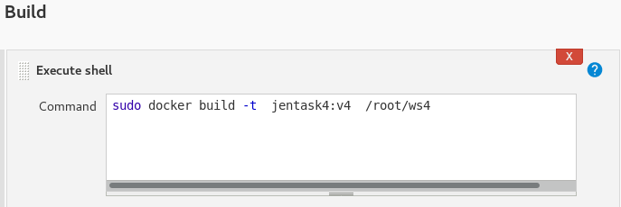
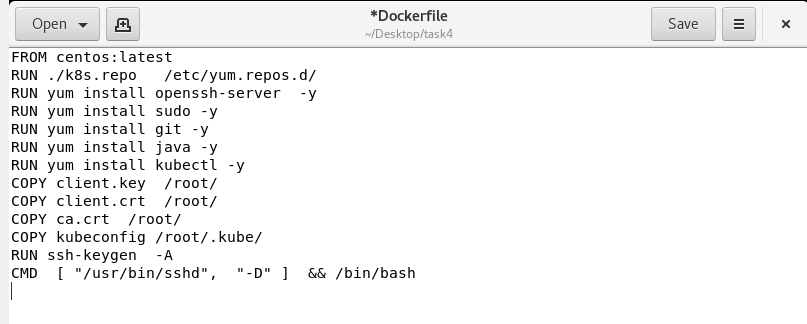

# DevOpstask4

Create A dynamic Jenkins cluster and perform task-3 using the dynamic Jenkins cluster.
Steps to proceed as:

1.  Create container image that’s has Linux  and other basic configuration required to run Slave for Jenkins. ( example here we require kubectl to be configured )
2. When we launch the job it should automatically starts job on slave based on the label provided for dynamic approach.
3. Create a job chain of job1 & job2 using build pipeline plugin in Jenkins 
4.  Job1 : Pull  the Github repo automatically when some developers push repo to Github and perform the following operations as:
    1.  Create the new image dynamically for the application and copy the application code into that corresponding docker image
    2.  Push that image to the docker hub (Public repository) 
 ( Github code contain the application code and Dockerfile to create a new image )
5. Job2 ( Should be run on the dynamic slave of Jenkins configured with Kubernetes kubectl command): Launch the application on the top of Kubernetes cluster performing following operations:
    1.  If launching first time then create a deployment of the pod using the image created in the previous job. Else if deployment already exists then do rollout of the existing pod making zero downtime  for the user.
    2. If Application created first time, then Expose the application. Else don’t expose it.
 
 # Requirement
 
 Before Starting the docker service we have to start the 
 remote login in the docker.
 for this we have to make changes in the file
 /usr/lib/systemd/system/docker.service
 
       [Unit]
    Description=Docker Application Container Engine
    Documentation=https://docs.docker.com
    BindsTo=containerd.service
    After=network-online.target firewalld.service
    Wants=network-online.target
    Requires=docker.socket

    [Service]
    Type=notify
    # the default is not to use systemd for cgroups because the delegate issues still
    # exists and systemd currently does not support the cgroup feature set required
    # for containers run by docker
    𝘌𝘹𝘦𝘤𝘚𝘵𝘢𝘳𝘵=/𝘶𝘴𝘳/𝘣𝘪𝘯/𝘥𝘰𝘤𝘬𝘦𝘳𝘥 -𝘏 𝘧𝘥:// -𝘏 𝘵𝘤𝘱://0.0.0.0:4243   <<---
    ExecReload=/bin/kill -s HUP $MAINPID
    TimeoutSec=0
    RestartSec=2
    Restart=always

    # Note that StartLimit* options were moved from "Service" to "Unit" in systemd 229.
    @@@                                                                             
    "/usr/lib/systemd/system/docker.service" 
    
Then we have to restart the docker services.
        
    systemctl daemon-reload
    systemctl restart docker
    
 # Step 1
  Firstly we have to create a Dockerfile having web server installed.
  Pushing the html code which will be launched on this web server 
  and this file to github.  
              
                    
                    FROM centos:latest
                    RUN yum install sudo -y
                    RUN yum install /sbin/service -y
                    RUN yum install httpd -y
                    COPY *.html /var/www/html
                    CMD /usr/sbin/httpd -DFOREGROUND && /bin/bash
                    EXPOSE 80
    
    
 # Step 2
 
 Here, we will create a Jenkins job which will download 
 the code and Dockerfile from the github automatically
 on pushing it to the github.
 
 

# Step 3

This Job of Jenkins will build our docker image from the file.
After building the image it can be pushed to docker hub public
repository.

# Step 4

we require a configuration of the kubectl
so creating a configuration file for it.

For creating the container image first we have to configure the
kubectl by creating a local yum repo of kubernetes in our redhat vm.

    
Before creating the docker file for the kubectl
we have to transfer client certificate, client key and 
ca certificate in our redhat vm to configure kubectl.
After transfering these files we will create this 
Dockerfile.

# Step 5

Before starting, we have to configure cloud for docker
in our jenkins, we need docker plugin for this or else
it won't work.

Docker Cloud Configuration:

# Step 6

Now we will create a jenkins job which will
deploy the image.
We can scale  the required replicas and kubernetes
will monitor the pods.

This is all about the task which is done Here!!
